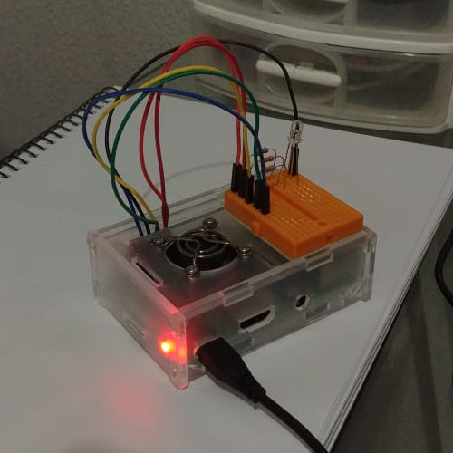
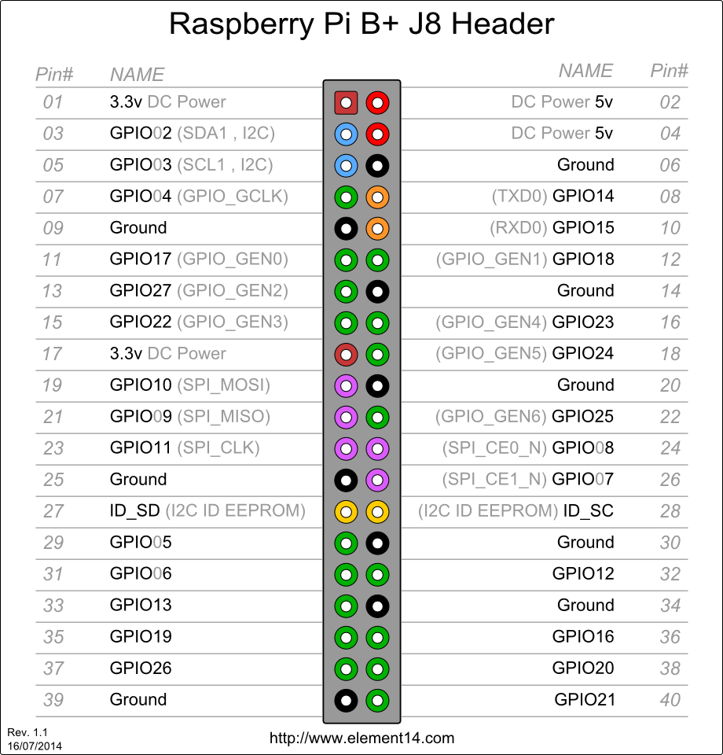

# sample-nodejs-raspberry-pi

a few experiments with raspberry pi and nodejs. we want to open doors.

using (for now)

- ground (09)
- GPIO04 (07)
- GPIO17 (11)
- GPIO27 (13)
- GPIO22 (15)
- GPIO23 (16)
- 3.3VDC (17)
